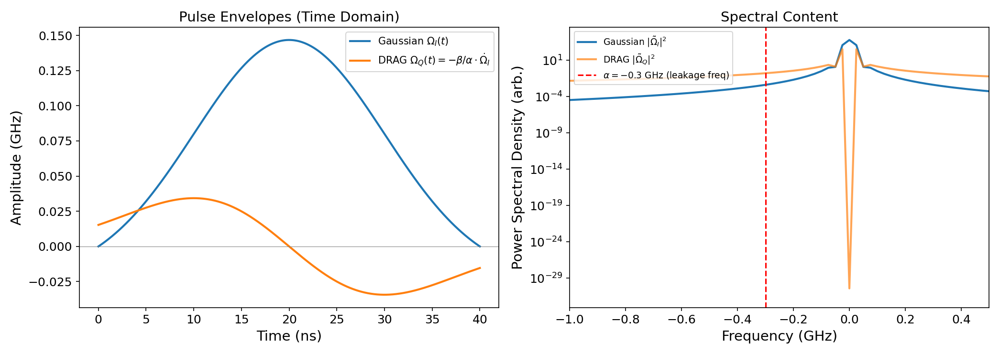
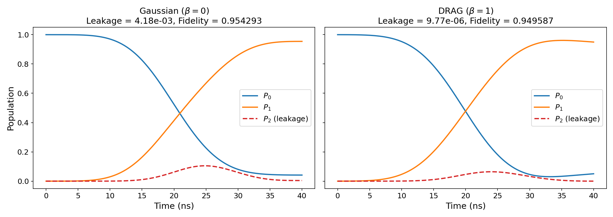
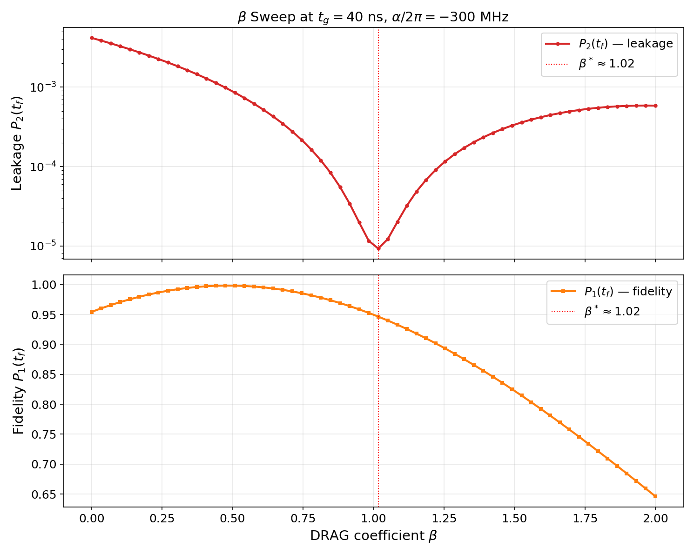
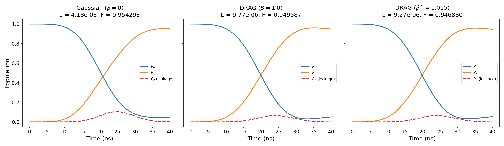
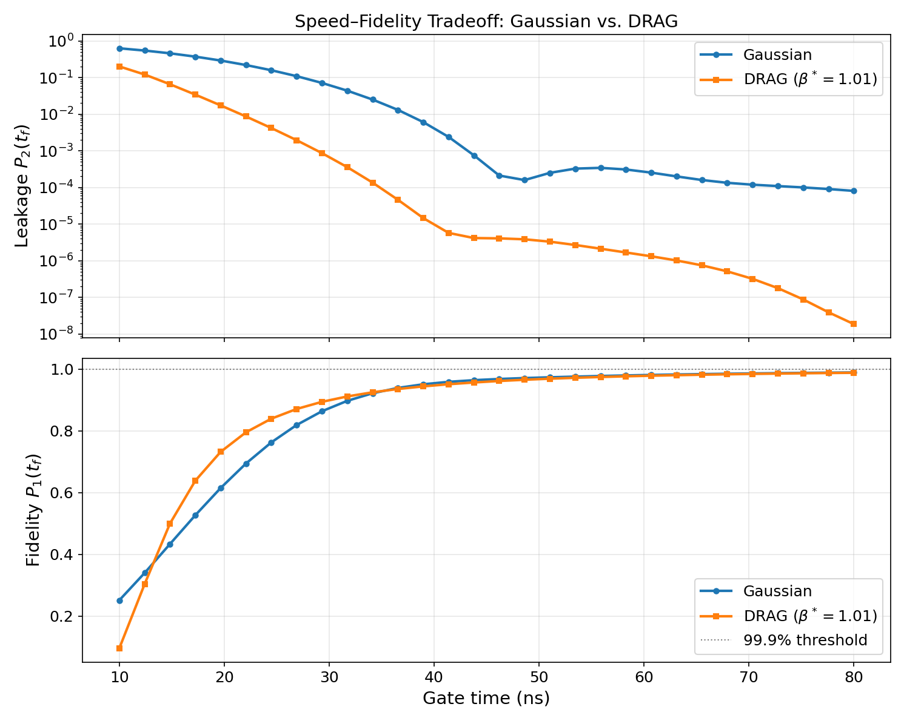
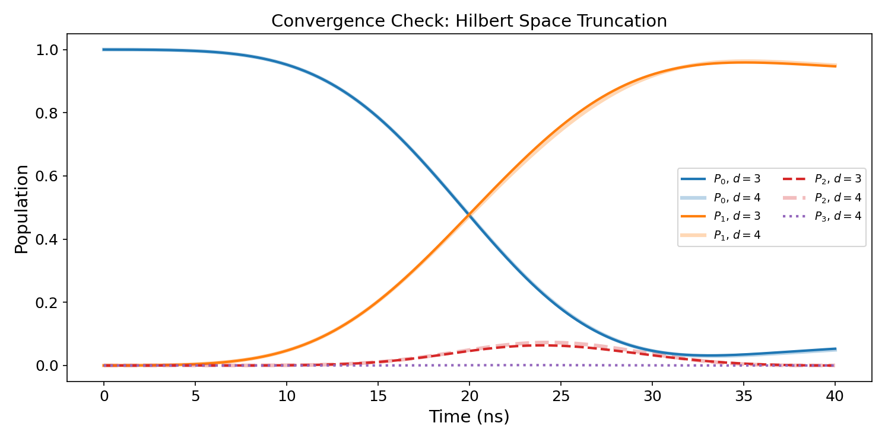
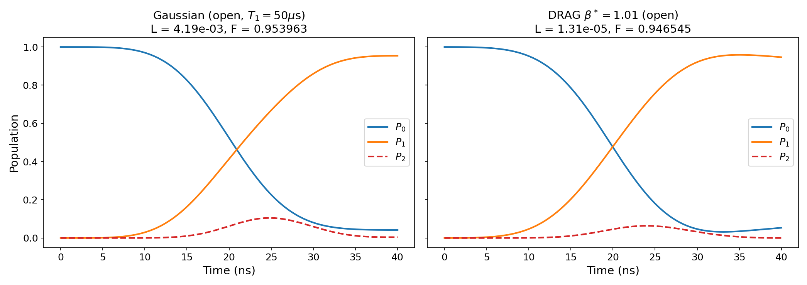
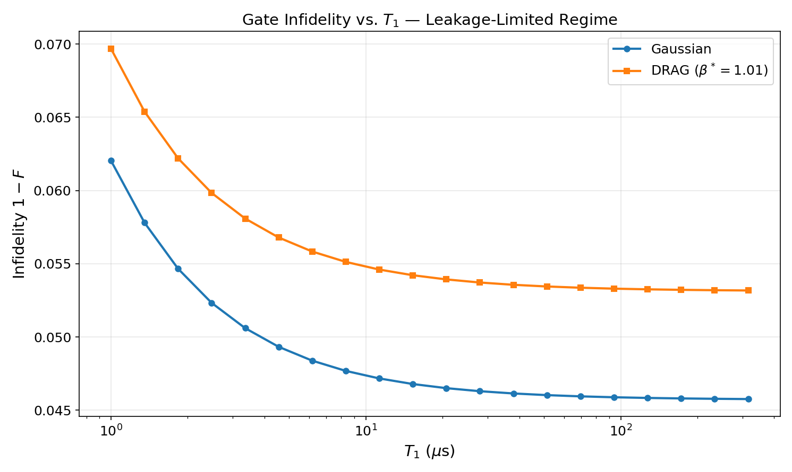

# QPulse: DRAG Pulse Simulation for Superconducting Transmon Qubits

A physics simulation demonstrating the **Derivative Removal by Adiabatic Gate (DRAG)** technique for suppressing leakage during fast single-qubit gates on a transmon. Built with [QuTiP 5](https://qutip.org/), NumPy, SciPy, and Matplotlib.

## Background

A transmon qubit is a weakly anharmonic oscillator — its energy levels are *nearly* equally spaced, separated by the qubit frequency $\omega_q/2\pi \sim 5\ \text{GHz}$, with an anharmonicity $\alpha/2\pi \sim -300\ \text{MHz}$ introduced by the Josephson junction's cosine potential. This small anharmonicity is what allows us to selectively address the $|0\rangle \leftrightarrow |1\rangle$ computational transition without exciting the $|1\rangle \leftrightarrow |2\rangle$ leakage transition — but only if our control pulses are spectrally narrow enough.

Fast gates require short, high-amplitude microwave pulses whose spectral bandwidth can overlap with the leakage transition at $\omega_{12} = \omega_q + \alpha$. DRAG ([Motzoi et al., PRL 103, 110501, 2009](https://journals.aps.org/prl/abstract/10.1103/PhysRevLett.103.110501)) solves this by adding a derivative component on the quadrature (Q) channel that destructively interferes with the leakage pathway.

### Hamiltonian

In the frame rotating at the drive frequency $\omega_d = \omega_q$, after the rotating-wave approximation:

$$H(t) = \frac{\alpha}{2}\hat{n}(\hat{n} - 1) + \frac{\Omega_I(t)}{2}(\hat{a} + \hat{a}^\dagger) + \frac{\Omega_Q(t)}{2} \cdot i(\hat{a}^\dagger - \hat{a})$$

where $\hat{a}$, $\hat{a}^\dagger$ are bosonic operators truncated to 3+ levels, $\Omega_I(t)$ is the Gaussian in-phase envelope calibrated for a $\pi$-rotation, and $\Omega_Q(t) = -\beta/\alpha \cdot d\Omega_I/dt$ is the DRAG correction.

## Results

### Simulation Parameters

| Parameter | Value | Description |
|---|---|---|
| $\omega_q/2\pi$ | 5.0 GHz | Qubit frequency |
| $\alpha/2\pi$ | -300 MHz | Anharmonicity |
| $t_g$ | 40 ns | Gate duration |
| $n_\sigma$ | 2 | Gaussian truncation ($\pm 2\sigma$) |
| $\Omega_\text{peak}/|\alpha|$ | 0.57 | Drive strength ratio |

### 1. Pulse Envelopes

The I-channel carries a Gaussian envelope for the $\pi$-rotation. The DRAG Q-channel adds the time-derivative of the Gaussian, scaled by $-\beta/\alpha$. In the frequency domain, the Q-channel provides spectral weight at exactly the leakage detuning $\alpha$ that cancels the Gaussian's contribution there.



### 2. Population Dynamics: Gaussian vs. DRAG

The core result. Starting from $|0\rangle$, a Gaussian $\pi$-pulse drives population to $|1\rangle$ but bleeds into $|2\rangle$ (dashed red). DRAG suppresses $P_2(t)$ by over two orders of magnitude.



### 3. DRAG Coefficient ($\beta$) Sweep

Sweeping the DRAG scaling parameter $\beta$ from 0 to 2 reveals a leakage minimum near $\beta \approx 1$, confirming the first-order analytic prediction. The scipy-optimized value is $\beta^* = 1.0146$.



### 4. Three-Panel Comparison

Side-by-side comparison of the bare Gaussian, first-order DRAG ($\beta = 1$), and scipy-optimized DRAG ($\beta^*$). The leakage trace $P_2(t)$ (dashed) shrinks dramatically with DRAG.



### 5. Speed-Fidelity Tradeoff

Shorter gates require stronger drives ($\Omega \propto 1/t_g$), increasing leakage as $\sim (\Omega/\alpha)^2$. DRAG pushes the leakage curve down by 2-3 orders of magnitude across all gate times, enabling faster gates at the same error budget.



### 6. Hilbert Space Convergence

Running with $d = 3$ and $d = 4$ levels produces nearly identical results for the computational subspace populations. Population in $|3\rangle$ is $\sim 10^{-8}$, confirming that 3-level truncation is sufficient for these drive strengths.



### 7. Open Quantum System (Lindblad)

Adding $T_1 = 50\ \mu\text{s}$ relaxation and $T_2 = 70\ \mu\text{s}$ dephasing via Lindblad collapse operators $\hat{L}_1 = \sqrt{1/T_1}\,\hat{a}$ and $\hat{L}_\phi = \sqrt{\gamma_\phi}\,\hat{n}$. At these coherence times, decoherence during a 40 ns gate is negligible — leakage dominates the error.



### 8. Leakage-Limited Regime

Sweeping $T_1$ from $1\ \mu\text{s}$ to $300\ \mu\text{s}$ shows the Gaussian infidelity saturating at long coherence times — proof that leakage, not decoherence, is the dominant error. DRAG breaks through this floor.



### Summary Table

| Pulse | Leakage $P_2(t_f)$ | Fidelity $P_1(t_f)$ |
|---|---|---|
| Gaussian ($\beta = 0$) | $4.18 \times 10^{-3}$ | 0.9543 |
| DRAG ($\beta = 1$) | $9.77 \times 10^{-6}$ | 0.9496 |
| DRAG ($\beta^* = 1.015$) | $9.27 \times 10^{-6}$ | 0.9469 |

DRAG achieves a **~450x reduction in leakage** at the cost of a small rotation-angle error from the Q-channel ac-Stark shift. In experiment, this is corrected by a DRAG detuning correction (second-order DRAG) or by simultaneous calibration of pulse amplitude and $\beta$.

## Project Structure

```
QPulse/
├── qpulse/
│   ├── transmon.py       # TransmonDRAG class: Hamiltonian builder + mesolve driver
│   ├── pulses.py         # GaussianPulse / DRAGPulse dataclasses
│   ├── metrics.py        # Leakage, fidelity, population extraction
│   ├── optimizer.py      # scipy.optimize β minimization
│   └── utils.py          # Operator constructors (a, a†, |n⟩⟨n|)
├── notebooks/
│   └── 01_drag_analysis.ipynb   # Interactive exploration
├── tests/
│   └── test_transmon.py         # 7 tests: spectrum, pulse area, Rabi, DRAG
├── docs/
│   ├── generate_figures.py      # Regenerate all plots
│   └── figures/                 # PNG outputs
└── pyproject.toml
```

## Quickstart

```bash
python -m venv .venv && source .venv/bin/activate
pip install -e .
pip install pytest

# Run tests
pytest tests/ -v

# Generate figures
python docs/generate_figures.py

# Interactive notebook
jupyter notebook notebooks/01_drag_analysis.ipynb
```

Requires Python 3.11+, QuTiP 5.x, NumPy, SciPy, Matplotlib.

## References

1. F. Motzoi, J. M. Gambetta, P. Rebentrost, and F. K. Wilhelm, "Simple pulses for elimination of leakage in weakly nonlinear qubits," [Phys. Rev. Lett. 103, 110501 (2009)](https://journals.aps.org/prl/abstract/10.1103/PhysRevLett.103.110501).
2. J. M. Gambetta, F. Motzoi, S. T. Merkel, and F. K. Wilhelm, "Analytic control methods for high-fidelity unitary operations in a weakly nonlinear oscillator," [Phys. Rev. A 83, 012308 (2011)](https://journals.aps.org/pra/abstract/10.1103/PhysRevA.83.012308).
3. R. Barends et al., "Superconducting quantum circuits at the surface code threshold for fault tolerance," [Nature 508, 500 (2014)](https://www.nature.com/articles/nature13171).
